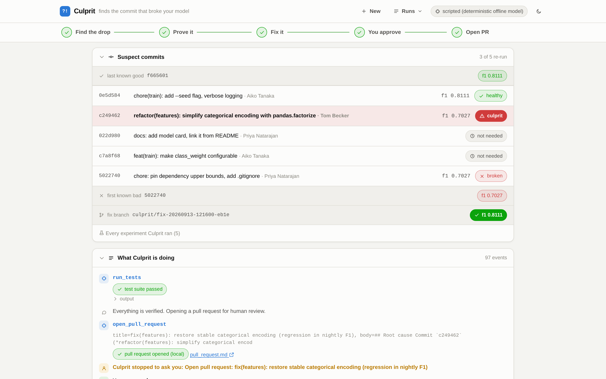
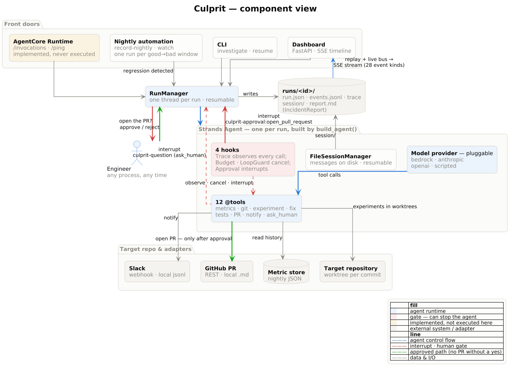

<div align="center">

# Culprit

**An ML metric drops. Every test is still green. Culprit finds the commit that did it — by re-running the experiments.**

[](https://github.com/danialmukash-cell/culprit/actions/workflows/ci.yml)
[](docs/evidence/release-tests.txt)
[](pyproject.toml)
[](https://strandsagents.com)
[](https://aws.amazon.com/bedrock/)
[](LICENSE)

**Culprit doesn't guess which commit broke your model. It reruns the experiments and proves it.**

</div>


<div align="center"><sub>
Built with the <a href="https://strandsagents.com">Strands Agents SDK</a> for the AWS <b>Agents for Humans</b> hackathon
(Professional Agents track). Amazon Bedrock is the default model provider; an Amazon Bedrock AgentCore Runtime
entrypoint is included.<br>
Screenshots come from the offline integration-test policy (<code>CULPRIT_MODEL_PROVIDER=scripted</code>), which drives the
same agent loop, tools, hooks and interrupt as a real model run — see
<a href="#status--what-is-verified-and-what-is-not">what is verified</a>.
</sub></div>

---

## The problem

Five pull requests merged yesterday. This morning's nightly evaluation is 17 points worse. **Every test is green.**

Someone senior now spends the morning on the same ritual as last time: find the last good run, check out commits one
by one, retrain, compare, read diffs, write a fix, prove it, write it up.

Monitoring tells you *that* the metric moved. Nothing does the **investigation** — because investigating means running
experiments and touching code.

## What Culprit does

| | Step | What actually happens |
|---|---|---|
| 🔍 | **Finds the drop** | Reads the recorded nightly metric history and isolates the last-good → first-bad window. |
| 🧪 | **Proves the culprit** | Checks each candidate commit out in an isolated git worktree and **runs the training and evaluation**. Diffs suggest hypotheses; measurements decide. |
| 🧠 | **Explains it** | Reads the culprit's diff plus the current code and states the mechanism. |
| 🔧 | **Fixes and verifies** | Edits code on a fix branch, re-runs the experiment to show the metric recovers, adds a regression test that would have caught the bug, runs the project's suite. |
| 🙋 | **Asks you once** | Pauses on a Strands *interrupt* — the only question it asks is "open this pull request?". |
| 🚀 | **Delivers** | Opens the PR, notifies the team channel, and emits a structured incident report. |

A run **only counts as a success** when the culprit is bracketed by experiments the agent actually ran, the metric
recovers on the fix branch when re-measured independently, and the project's tests pass. A fabricated report cannot
pass. See [how that is scored](#does-a-real-model-solve-a-regression-it-has-never-seen).

## Try it in three commands

No AWS account, no API key, no credentials — the offline policy drives the real agent loop.

```bash
git clone https://github.com/danialmukash-cell/culprit.git && cd culprit
pip install -e ".[dev]"
culprit demo init && culprit serve --open
```

Pick the demo repository, press **Investigate**, and watch it work. It pauses once and asks you to approve the pull
request. Full walkthrough, Windows commands and troubleshooting: **[docs/quickstart.md](docs/quickstart.md)**.

> Prefer a container? `docker compose up` — see **[docs/self-hosting.md](docs/self-hosting.md)**.

<table>
<tr>
<td width="50%"></td>
<td width="50%"></td>
</tr>
<tr>
<td align="center"><sub><b>The only question it asks.</b> The PR it wrote, before it opens it.</sub></td>
<td align="center"><sub><b>The receipts.</b> Every commit it re-ran and what each one measured.</sub></td>
</tr>
</table>

## What it offers

| | |
|---|---|
| **Proof, not correlation** | Every verdict is backed by an experiment the agent ran itself, in an isolated worktree, at that commit. |
| **One interruption** | Human approval only for consequential actions (`open_pull_request` by default, configurable). Everything else runs unattended. |
| **Resume from anywhere** | The Strands session is persisted, so a run paused in the dashboard can be approved from a terminal — or after a restart, from a different process. |
| **Nobody has to notice first** | `culprit watch` turns a nightly job into the trigger; the human is contacted only when the run pauses. |
| **Guard-railed** | Experiment budget, loop detection, subprocess timeouts, dirty-tree and bad-ref handling, provider preflight. |
| **Bring your own repo** | One `.culprit.yaml`. Your experiment command, your metric, your test command. |
| **Bring your own model** | Bedrock by default; Anthropic, OpenAI, or the deterministic offline policy with one env var. |
| **Bring your own tracker** | The metric store is one adapter file — the JSON shape MLflow / W&B / SageMaker Experiments already give you. |
| **Self-hostable** | `docker compose up`, with a demo-only lockdown mode and API token for public instances. |
| **Honest about itself** | [`docs/validation.md`](docs/validation.md) separates what has been executed from what has only been implemented. |

## How it works



📈 **[One investigation, end to end](docs/diagrams/investigation-sequence.png)** — the full sequence diagram, with the
approval interrupt and the cross-process resume as its centrepiece.
🚢 **[Deployment & self-hosting view](docs/diagrams/deployment.png)** — colour-coded by what has actually been executed.

Diagram sources (PlantUML) and how to re-render them: [`docs/diagrams/`](docs/diagrams/). Prose walkthrough:
[`docs/architecture.md`](docs/architecture.md).

## Two demo repositories, two very different purposes

| | `churn-model` (`culprit demo init`) | `fraud-risk` (`culprit demo init-secondary`) |
|---|---|---|
| Regression | categorical encoding became order-dependent (`pandas.factorize`) → F1 0.83 → 0.66 | training and holdout features transformed differently after a "perf" refactor → PR-AUC 0.80 → 0.45 |
| Model | logistic regression | histogram gradient boosting |
| Known to the offline `ScriptedModel`? | **yes** — it replays this exact solution; it is the deterministic integration test of the whole loop | **no** — the offline policy stops after bisection and says so |
| Purpose | prove the *machinery* (tools, hooks, interrupt, resume, report) works, without credentials | prove a *real model* can investigate a regression it has never seen |

Both repositories are generated: seeded data, seven commits with realistic dates and authors, and a nightly metric
history produced by actually training at each commit. **Their own test suites stay green at the broken commit** — the
regressions are silent by construction.

## Using it

```bash
culprit doctor                              # git, credentials, and "does the model answer?"
culprit demo init                           # churn-model: the golden path
culprit demo init-secondary                 # fraud-risk: the unseen regression
culprit investigate demo/churn-model        # terminal, live timeline, prompts for approval
culprit serve --open                        # ...or the dashboard

culprit runs                                # list runs
culprit resume <run-id> --approve           # or --reject --comment "wait for the data team"
culprit show <run-id>                       # the incident report

culprit record-nightly <repo>               # what a nightly job does: evaluate HEAD, append to the metric store
culprit watch <repo> --once                 # regression over threshold? start an investigation for that window
culprit evaluate --scenario fraud           # score the configured model against ground truth
```

The investigation pauses at the pull request, and the Strands session is persisted — so `culprit resume` works from
any terminal, in any process, even after a restart.

### Point it at your own repository

Add a `.culprit.yaml` to the repository root (full reference: [`config/culprit.example.yaml`](config/culprit.example.yaml)):

```yaml
metric: f1
higher_is_better: true
regression_threshold: 0.03
experiment_command: "python -m churn.train --config {config} --out {out}"   # must write a metrics JSON to {out}
test_command: "python -m pytest -q"
metrics_history: "nightly/metrics_history.json"    # your nightly job's metric records
default_config: smoke
```

The metric store is a JSON list of runs (`run_id`, `timestamp`, `commit`, `metrics`) — the shape MLflow / W&B /
SageMaker Experiments give you; [`adapters/metric_store.py`](src/culprit/adapters/metric_store.py) is the one place to
plug a tracking server in. With `GITHUB_TOKEN` (and a GitHub remote) the PR is real; with `SLACK_WEBHOOK_URL` the
notification is real; without them both are written locally, so the workflow never blocks on credentials.

### Choosing a model

```bash
export AWS_REGION=us-west-2                          # + credentials with bedrock:InvokeModel*  (default)
CULPRIT_MODEL_PROVIDER=anthropic ANTHROPIC_API_KEY=…  # pip install "strands-agents[anthropic]"
CULPRIT_MODEL_PROVIDER=openai    OPENAI_API_KEY=…     # pip install "strands-agents[openai]"
CULPRIT_MODEL_PROVIDER=scripted                       # deterministic offline policy (what CI uses)
```

### Nobody has to notice the regression first

The story does not start with an engineer typing a command — it starts with a nightly job. `culprit watch` remembers
which windows it has handled (`runs/_watch/`), so a cron entry or a scheduled workflow can call it every night
idempotently. The human is contacted **only** when the run pauses for approval: the watcher posts the approval
instructions (Slack webhook if configured, otherwise a local notification file) and exits with status 3.
[`scripts/nightly.sh`](scripts/nightly.sh) reproduces the whole chain — yesterday's merges, tonight's nightly, the
trigger, the pause — in about a minute, offline.
[`.github/workflows/nightly-culprit.yml`](.github/workflows/nightly-culprit.yml) shows the same chain as a scheduled
GitHub Actions job (an example; not executed by the authors).

## Does a real model solve a regression it has never seen?

That is the question this project has to answer, and it is answered by measurement, not by the demo:

```bash
culprit evaluate --scenario fraud    # regenerate fraud-risk, run the configured model, score the run
```

The evaluator tells the model nothing beyond the repository and its `.culprit.yaml`. Afterwards it compares the run
with the scenario's ground truth and **independently** re-runs the fast experiment on the agent's fix branch and the
project's tests, then writes `runs/<run_id>/evaluation.json`: number of experiments, predicted vs. expected culprit,
the explanation, files changed, recovered metric, guard-test status, tool calls, token usage, duration.

A run counts as a success only when the culprit is correct **and bracketed by experiments the agent actually ran**
(culprit and its parent both measured), the evaluator's own re-measurement shows the metric recovered, and the
project's tests pass on the fix branch.

### Status — what is verified and what is not

**VERIFIED (executed in this repository, reproducible with `pytest -q` — 67 tests):** the complete agent loop on the
real Strands `Agent` with the deterministic offline policy — bisection, fix, guard test, approval interrupt,
cross-process resume, structured report, PR/notification adapters, CLI, dashboard API,
autonomous trigger, hardening (timeouts, bad refs, loops, dirty trees, provider preflight); both scenarios'
regressions are real and silent; the evaluator scores the offline policy correctly on both (churn: success; fraud:
correct bisection, no fix, `success: false`).

**IMPLEMENTED BUT NOT EXTERNALLY VERIFIED:** any real-model run (Bedrock Claude on either scenario), the AgentCore
entrypoint and deployment (no test imports `culprit.agentcore_app`), GitHub/Slack adapters against live endpoints,
the scheduled GitHub Actions example. The build environment
could not reach any AWS endpoint ([`docs/evidence/aws-access-attempt.md`](docs/evidence/aws-access-attempt.md)).
[`docs/validation.md`](docs/validation.md) has the full list and a results log to fill in from `evaluation.json`.

## How Strands is used

| Strands feature | Where | Why it matters |
|---|---|---|
| `Agent` + `@tool` (12 tools, instance-bound) | [`tools/investigation.py`](src/culprit/tools/investigation.py) | Real work: git worktrees, subprocess experiments, file edits, PRs |
| **Interrupts** from a `BeforeToolCallEvent` hook and from a tool via `ToolContext.interrupt` | [`hooks/approval.py`](src/culprit/hooks/approval.py), `ask_human` | Human approval for consequential actions; questions only when judgment is needed |
| `FileSessionManager` | [`agents/investigator.py`](src/culprit/agents/investigator.py) | Resume an interrupted run from another process (CLI, web, AgentCore) |
| Hooks: `BeforeToolCallEvent`, `AfterToolCallEvent`, `Before/AfterModelCallEvent`, `MessageAddedEvent` | [`hooks/`](src/culprit/hooks/) | Budget and loop guard-rails (`cancel_tool` with instructions), tracing, live UI events |
| `SlidingWindowConversationManager(window_size=200, pin_first=1)` | `investigator.py` | Long investigations keep the task and metric history in context |
| `structured_output_model=IncidentReport` | [`service.py`](src/culprit/service.py) | Typed, validated post-mortem |
| `SequentialToolExecutor`, `trace_attributes`, built-in model retries | `investigator.py` | Safe git access, observability, resilience |
| Custom `Model` provider | [`agents/scripted_model.py`](src/culprit/agents/scripted_model.py) | Deterministic integration-test fixture / offline demo (churn only) |
| `BedrockModel` (default), Anthropic/OpenAI providers | `make_model()` | Bedrock first; swap providers with one env var |

## Deploying

| Target | Command | Status |
|---|---|---|
| Local dashboard | `culprit serve` | verified |
| Container / self-hosted | `docker compose up` — [docs/self-hosting.md](docs/self-hosting.md) | verified locally |
| Amazon Bedrock AgentCore Runtime | `docker build -f Dockerfile` — [docs/deploy-agentcore.md](docs/deploy-agentcore.md) | contract exercised in tests; **not deployed** |

`culprit.agentcore_app` implements the AgentCore Runtime contract (`POST /invocations`, `GET /ping`, port 8080) and
streams the investigation timeline; approval is a second invocation. An actual AgentCore deployment has **not** been
performed — the build environment had no route to AWS.

> **Hosting a public demo?** Set `CULPRIT_API_TOKEN` and `CULPRIT_DEMO_ONLY=true`. An arbitrary repository's
> `experiment_command` is an arbitrary shell command, so a public instance must never run strangers' repos. Details and
> the full blast radius: [docs/self-hosting.md](docs/self-hosting.md#security).

## Repository layout

```
src/culprit/
  agents/        investigator.py (agent assembly), prompts.py, scripted_model.py (offline test policy)
  tools/         investigation.py — the 12 tools
  hooks/         approval.py (interrupts), budget.py, loop_guard.py, tracing.py
  adapters/      metric_store.py, github.py, slack.py
  demo/          builder.py (shared plumbing), generator.py + project.py (churn),
                 fraud_generator.py + fraud_project.py (fraud-risk), scenarios.py (registry)
  evaluation.py  generalization evaluator (culprit evaluate)
  automation.py  nightly record + regression trigger (culprit record-nightly / culprit watch)
  web/           app.py (FastAPI + SSE) and static/index.html (the dashboard)
  service.py     RunManager: lifecycle, persistence, resume, reporting
  cli.py         Typer CLI
  agentcore_app.py  Bedrock AgentCore Runtime entrypoint
config/          example .culprit.yaml
docs/            quickstart, self-hosting, architecture + PlantUML diagrams, validation status, evidence/
examples/        sample incident report, PR, metric history (from the offline policy)
scripts/         nightly.sh (autonomous trigger demo), demo.sh, screenshots.py (regenerates the shots above)
tests/           67 tests: golden path with interrupt + resume, both scenarios, evaluator, hardening, automation
```

## Documentation

| | |
|---|---|
| [Quickstart](docs/quickstart.md) | Clone to a finished investigation, step by step |
| [Self-hosting](docs/self-hosting.md) | Docker, compose, bare metal, security, env reference |
| [Architecture](docs/architecture.md) · [Diagrams](docs/diagrams/) | How it fits together |
| [Validation status](docs/validation.md) | Exactly what has and has not been executed |
| [AgentCore deployment](docs/deploy-agentcore.md) | Container build and runtime deployment |
| [Demo script](docs/demo-script.md) · [Devpost](docs/devpost-submission.md) · [Build story](docs/build-story.md) | Submission material |
| [Reviewer handoff](docs/ASTRA_HANDOFF.md) · [Status checklist](TODO_CHECKLIST.md) | For reviewers |

## License

MIT — see [LICENSE](LICENSE).
