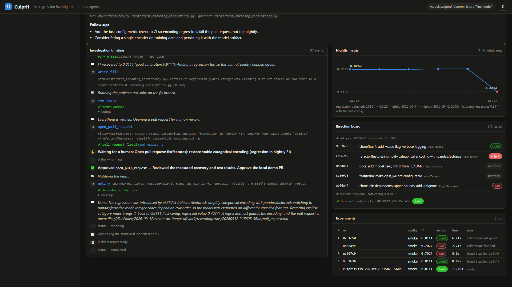
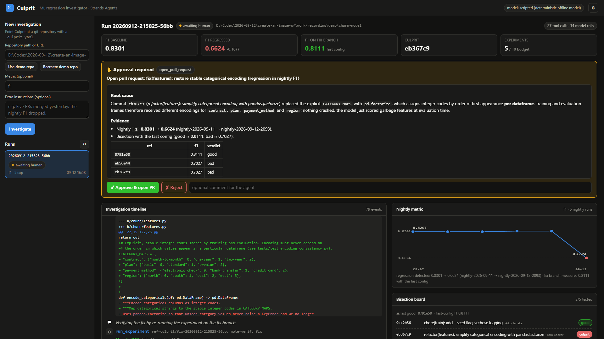
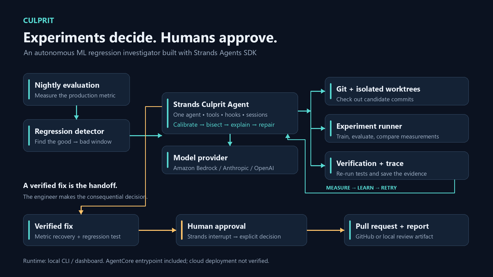

# Culprit — the ML regression investigator

  

> An ML metric silently regresses after several code changes. Tests are still green. **Culprit**
> autonomously isolates the causal commit by re-running experiments, identifies the mechanism, writes
> and verifies a fix, adds a guard test, and asks the engineer only before opening the PR.

**Culprit doesn't guess which commit broke your model. It reruns the experiments and proves it.**

Built with the [Strands Agents SDK](https://strandsagents.com) for the AWS **Agents for Humans**
hackathon (Professional Agents track). Amazon Bedrock is the default model provider; an Amazon Bedrock
AgentCore Runtime entrypoint is included.



<p align="center"></p>

<sub>Screenshots are from the offline integration-test policy (`CULPRIT_MODEL_PROVIDER=scripted`), which
drives the same agent loop, tools, hooks and interrupt as a real model run. See
<a href="docs/validation.md">validation status</a> for what has and has not been executed with a real model.</sub>

## Verified release status

The latest independent review passed **67 tests** and Ruff. The demo video records real experiments and human approval with the explicitly labelled **scripted** provider. Live-model fraud validation and AgentCore cloud deployment are still pending. See [release review](docs/release-review.md) and [recorded evaluation](docs/evidence/recorded-demo-evaluation.json).



### Windows quick start (PowerShell)

```powershell
python -m venv .venv
.\.venv\Scripts\Activate.ps1
python -m pip install -e ".[dev]"
$env:PYTHONUTF8 = "1"
$env:CULPRIT_MODEL_PROVIDER = "scripted"
pytest -q
culprit demo init
culprit serve
```

Open the printed local dashboard URL, choose the demo repository and start an investigation. Approve the proposed local PR in the dashboard. To demonstrate the automatic trigger, generate with `culprit demo init --without-latest-nightly`, then run `culprit record-nightly demo/churn-model` and `culprit watch demo/churn-model --once`. Exit status 3 means awaiting approval.

## The problem

Five pull requests merged yesterday. This morning's nightly evaluation is 17 points worse. Every test
is green. Someone senior now spends the morning doing the same ritual as last time: find the last good
run, check out commits one by one, retrain, compare, read diffs, write a fix, prove it, write it up.
Monitoring tools raise the alarm. Nothing does the *investigation*, because the investigation means
running experiments and touching code.

## What Culprit does

1. **Observes** — reads the recorded evaluation history and finds the last-good → first-bad window.
2. **Reasons** — lists the candidate commits and calibrates what "good" and "bad" look like under the
   project's fast experiment config.
3. **Proves** — bisects by checking each candidate out in an isolated git worktree and *running the
   training and evaluation*. Diffs suggest hypotheses; measurements decide.
4. **Explains** — reads the culprit's diff and the current code and states the mechanism.
5. **Fixes** — edits the code on a fix branch, re-runs the experiment to show the metric recovers, adds a
   regression test that would have caught the bug, runs the test suite.
6. **Asks once** — pauses (a Strands *interrupt*) for the engineer to approve the pull request.
7. **Delivers** — opens the PR, notifies the team channel, and emits a structured incident report.

## Two demo repositories, two very different purposes

| | `churn-model` (`culprit demo init`) | `fraud-risk` (`culprit demo init-secondary`) |
|---|---|---|
| Regression | categorical encoding became order-dependent (`pandas.factorize`) → F1 0.83 → 0.66 | training and holdout features transformed differently after a "perf" refactor → PR-AUC 0.80 → 0.45 |
| Model | logistic regression | histogram gradient boosting |
| Known to the offline `ScriptedModel`? | **yes** — it replays this exact solution; it is the deterministic integration test of the whole loop | **no** — the offline policy stops after bisection and says so |
| Purpose | prove the *machinery* (tools, hooks, interrupt, resume, report) works, without credentials | prove a *real model* can investigate a regression it has never seen |

Both repositories are generated (seeded data, seven commits with realistic dates and authors, nightly
metric history produced by actually training at each commit). Their own test suites stay green at the
broken commit — the regressions are silent by construction.

## Quick start

```bash
git clone https://github.com/danialmukash-cell/culprit.git && cd culprit
python -m venv .venv && source .venv/bin/activate
pip install -e ".[dev]"

pytest -q                                   # 67 tests, no credentials needed

culprit demo init                           # churn-model: the golden path
culprit demo init-secondary                 # fraud-risk: the unseen regression
CULPRIT_MODEL_PROVIDER=scripted scripts/nightly.sh   # autonomous trigger demo, offline (see below)

# Real model (Amazon Bedrock; default model = Strands' default Claude Sonnet)
export AWS_REGION=us-west-2                 # + AWS credentials with bedrock:InvokeModel*
culprit doctor                              # checks git, credentials and that the Bedrock model answers
culprit investigate demo/churn-model        # terminal, live timeline, prompts for approval
culprit serve --open                        # ...or the dashboard: paste demo/fraud-risk to try the unseen one

# Offline integration-test policy (what CI uses; knows only the churn demo)
CULPRIT_MODEL_PROVIDER=scripted culprit investigate demo/churn-model
```

Other providers: `CULPRIT_MODEL_PROVIDER=anthropic` (+ `ANTHROPIC_API_KEY`) or `openai`
(+ `OPENAI_API_KEY`), after `pip install "strands-agents[anthropic]"` / `[openai]`.

### Approve from anywhere

The investigation pauses at the pull request. Approve in the dashboard, or from any terminal — even
after a restart, because the Strands session is persisted:

```bash
culprit runs                         # find the run id
culprit resume <run-id> --approve    # or --reject --comment "wait for the data team"
culprit show <run-id>                # the incident report
```

## Does the real model actually solve an unseen regression?

That is the question this project must answer, and it is answered by measurement, not by the demo:

```bash
culprit evaluate --scenario fraud    # regenerate fraud-risk, run the configured model, score the run
```

The evaluator tells the model nothing beyond the repository and its `.culprit.yaml`. Afterwards it
compares the run with the scenario's ground truth and **independently** re-runs the fast experiment on
the agent's fix branch and the project's tests, then writes `runs/<run_id>/evaluation.json` with the
number of experiments, the predicted vs. expected culprit, the explanation, files changed, recovered
metric, guard-test status, tool calls, token usage and duration.

A run only counts as a success when the culprit is correct **and bracketed by experiments the agent
actually ran** (culprit and its parent both measured), the evaluator's own re-measurement shows the
metric recovered, and the project's tests pass on the fix branch. A fabricated report cannot pass.

### Status — what is verified and what is not

**VERIFIED (executed in this repository, reproducible with `pytest -q`):** the complete agent loop on
the real Strands `Agent` with the deterministic offline policy — bisection, fix, guard test, approval
interrupt, cross-process resume, structured report, PR/notification adapters, CLI, dashboard API,
AgentCore entrypoint contract, autonomous trigger, hardening (timeouts, bad refs, loops, dirty trees,
provider preflight); both scenarios' regressions are real and silent; the evaluator scores the offline
policy correctly on both (churn: success; fraud: correct bisection, no fix, `success: false`).

**IMPLEMENTED BUT NOT EXTERNALLY VERIFIED:** any real-model run (Bedrock Claude on either scenario),
the AgentCore deployment, GitHub/Slack adapters against live endpoints, the scheduled GitHub Actions
example. The build environment could not reach any AWS endpoint (`docs/evidence/aws-access-attempt.md`).
`docs/validation.md` has the full list and a results log to fill in from `evaluation.json`.

## Nobody has to notice the regression first

The hackathon story does not start with an engineer typing a command. It starts with a nightly job:

```bash
culprit record-nightly <repo>          # what the nightly job does: evaluate HEAD, append to the metric store
culprit watch <repo> --once            # regression above threshold? start Culprit for that good→bad window (once)
```

`culprit watch` remembers which windows it has handled (`runs/_watch/`), so a cron entry or a scheduled
workflow can call it every night idempotently. The human is contacted **only** when the run pauses for
approval: the watcher posts the approval instructions (Slack webhook if configured, otherwise a local
notification file) and exits with status 3. `scripts/nightly.sh` reproduces the whole chain on the demo
repository — yesterday's merges, tonight's nightly, the trigger, the pause — in about a minute offline.
`.github/workflows/nightly-culprit.yml` shows the same chain as a scheduled GitHub Actions job
(an example; not executed by the authors).

## Point it at your own repository

Add a `.culprit.yaml` to the repository root (see `config/culprit.example.yaml`):

```yaml
metric: f1
higher_is_better: true
regression_threshold: 0.03
experiment_command: "python -m churn.train --config {config} --out {out}"   # must write a metrics JSON to {out}
test_command: "python -m pytest -q"
metrics_history: "nightly/metrics_history.json"    # your nightly job's metric records
default_config: smoke
```

The metric store is a JSON list of runs (`run_id`, `timestamp`, `commit`, `metrics`) — the shape
MLflow / W&B / SageMaker Experiments give you; `culprit/adapters/metric_store.py` is the one place
to plug a tracking server in. With `GITHUB_TOKEN` (and a GitHub remote) the PR is real; with
`SLACK_WEBHOOK_URL` the notification is real; without them both are written locally so the workflow
never blocks on credentials.

## How Strands is used

| Strands feature | Where | Why it matters |
|---|---|---|
| `Agent` + `@tool` (12 tools, instance-bound) | `culprit/tools/investigation.py` | Real work: git worktrees, subprocess experiments, file edits, PRs |
| **Interrupts** from a `BeforeToolCallEvent` hook and from a tool via `ToolContext.interrupt` | `culprit/hooks/approval.py`, `ask_human` | Human approval for consequential actions; questions only when judgment is needed |
| `FileSessionManager` | `culprit/agents/investigator.py` | Resume an interrupted run from another process (CLI, web, AgentCore) |
| Hooks: `BeforeToolCallEvent`, `AfterToolCallEvent`, `Before/AfterModelCallEvent`, `MessageAddedEvent` | `culprit/hooks/` | Budget and loop guard-rails (`cancel_tool` with instructions), tracing, live UI events |
| `SlidingWindowConversationManager(window_size=200, pin_first=1)` | `investigator.py` | Long investigations keep the task and metric history in context |
| `structured_output_model=IncidentReport` | `culprit/service.py` | Typed, validated post-mortem |
| `SequentialToolExecutor`, `trace_attributes`, built-in model retries | `investigator.py` | Safe git access, observability, resilience |
| Custom `Model` provider | `culprit/agents/scripted_model.py` | Deterministic integration-test fixture / offline demo (churn only) |
| `BedrockModel` (default), Anthropic/OpenAI providers | `make_model()` | Bedrock first; swap providers with one env var |

## Repository layout

```
src/culprit/
  agents/        investigator.py (agent assembly), prompts.py, scripted_model.py (offline test policy)
  tools/         investigation.py — the 12 tools
  hooks/         approval.py (interrupts), budget.py, loop_guard.py, tracing.py
  adapters/      metric_store.py, github.py, slack.py
  demo/          builder.py (shared plumbing), generator.py + project.py (churn),
                 fraud_generator.py + fraud_project.py (fraud-risk), scenarios.py (registry)
  evaluation.py  generalization evaluator (culprit evaluate)
  automation.py  nightly record + regression trigger (culprit record-nightly / culprit watch)
  web/           app.py (FastAPI + SSE) and static/index.html (dashboard)
  service.py     RunManager: lifecycle, persistence, resume, reporting
  cli.py         Typer CLI
  agentcore_app.py  Bedrock AgentCore Runtime entrypoint
config/          example .culprit.yaml
docs/            architecture, validation status, ASTRA handoff, demo script, Devpost copy, build story, AgentCore deployment, evidence/
examples/        sample incident report, PR, metric history (from the offline policy)
scripts/         nightly.sh (autonomous trigger demo), demo.sh
tests/           64 tests: golden path with interrupt + resume, both scenarios, evaluator, hardening, automation
```

## Deploy to Amazon Bedrock AgentCore

`culprit.agentcore_app` implements the AgentCore Runtime contract (`POST /invocations`, `GET /ping`,
port 8080) and streams the investigation timeline. The approval is a second invocation:

```bash
python -m culprit.agentcore_app          # local: same contract as the runtime
curl -N -X POST localhost:8080/invocations -H 'content-type: application/json' \
     -d '{"action": "investigate", "repo": "demo"}'
curl -N -X POST localhost:8080/invocations -H 'content-type: application/json' \
     -d '{"action": "respond", "run_id": "<run id>", "decision": "approve"}'
```

Container build and deployment steps are in [`docs/deploy-agentcore.md`](docs/deploy-agentcore.md).
The contract is exercised locally in tests; **an actual AgentCore deployment has not been performed** —
the build environment had no route to AWS (see `docs/evidence/aws-access-attempt.md`).

### Hosting the dashboard as a live demo

`culprit serve --host 0.0.0.0` works on any box with AWS credentials. Before exposing it, set
`CULPRIT_API_TOKEN=<secret>` (the UI asks for it once) and `CULPRIT_DEMO_ONLY=true`, which restricts
investigations to the bundled demo repository — an arbitrary repository's `experiment_command` is a
shell command, so a public instance must never run strangers' repos.

## Documentation

* [Reviewer handoff](docs/ASTRA_HANDOFF.md) · [Validation status](docs/validation.md) · [Architecture](docs/architecture.md) ·
  [Demo script](docs/demo-script.md) · [Devpost submission](docs/devpost-submission.md) ·
  [Build story](docs/build-story.md) · [AgentCore deployment](docs/deploy-agentcore.md) ·
  [Status checklist](TODO_CHECKLIST.md)

## License

MIT — see [LICENSE](LICENSE).
