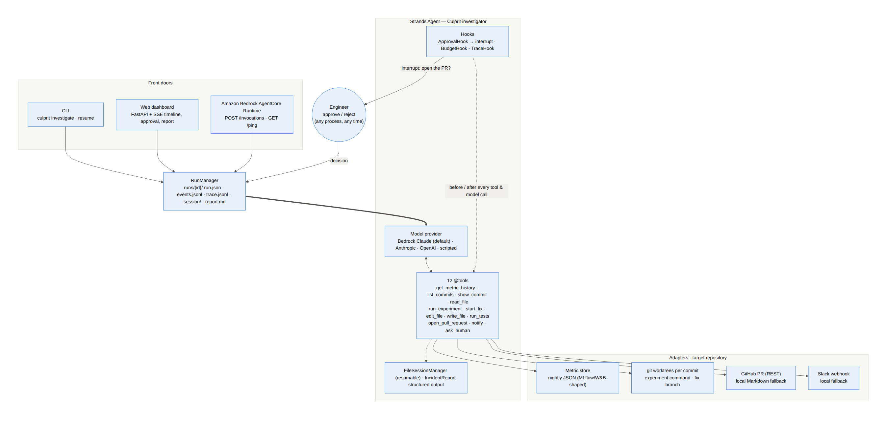
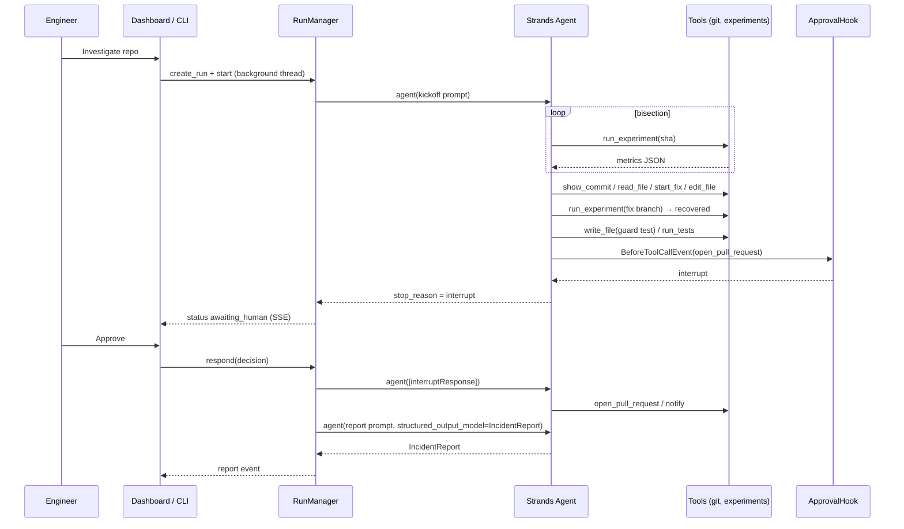

# Architecture

Culprit is a single, purpose-built Strands agent wrapped in a small product: a run manager that
persists everything, a tool set that does real work in a git repository, hooks that add approval,
budget and observability, and three front doors (CLI, web dashboard, AgentCore Runtime).



## Components

| Layer | Module | What it does |
|---|---|---|
| **Front doors** | `culprit/cli.py`, `culprit/web/app.py` + `web/static/index.html`, `culprit/agentcore_app.py` | Typer CLI with a rich live timeline; FastAPI JSON API + server-sent events feeding a single-page dashboard (bisection board, metric chart, approval card, incident report); Bedrock AgentCore Runtime entrypoint (`/invocations`, `/ping`) that streams the same events. |
| **Run manager** | `culprit/service.py` | Creates runs, builds the agent, executes it in a background thread, persists `run.json` / `events.jsonl` / `trace.jsonl`, pauses on interrupts, resumes from any process, produces the structured report and `report.md`. |
| **Agent** | `culprit/agents/investigator.py`, `agents/prompts.py` | One Strands `Agent`: Bedrock Claude by default (Anthropic/OpenAI providers optional), `FileSessionManager` for durable conversations, `SequentialToolExecutor` (experiments share a git repo), `structured_output_model=IncidentReport` for the final report. |
| **Tools** | `culprit/tools/investigation.py` | 12 `@tool`s bound to one investigation: `get_metric_history`, `list_commits`, `show_commit`, `read_file`, `run_experiment`, `start_fix`, `edit_file`, `write_file`, `run_tests`, `open_pull_request`, `notify`, `ask_human`. |
| **Hooks** | `culprit/hooks/approval.py`, `hooks/budget.py`, `hooks/tracing.py` | `ApprovalHook` raises a Strands **interrupt** before consequential tools; `BudgetHook` caps experiments and cancels the tool with guidance; `TraceHook` logs every model/tool call and emits UI events. |
| **Adapters** | `culprit/adapters/metric_store.py`, `adapters/github.py`, `adapters/slack.py` | Metric store (JSON reference implementation shaped like MLflow/W&B records), GitHub pull requests (REST) with a local Markdown fallback, Slack webhook with a local fallback. |
| **Offline test policy** | `culprit/agents/scripted_model.py` | A deterministic `strands.models.Model` implementation that replays the churn golden path (generic bisection, hard-coded fix). Integration-test fixture and credential-free demo mode only; it stops after bisection on any other repository. |
| **Demo scenarios** | `culprit/demo/` (`builder.py`, `scenarios.py`, `generator.py`, `fraud_generator.py`) | Generate `churn-model` (known to the offline policy) and `fraud-risk` (unseen): runnable ML projects with seven-commit histories, one silent regression each, and nightly metric histories produced by actually training at each commit. |
| **Evaluator** | `culprit/evaluation.py` | `culprit evaluate`: runs the configured model on a scenario, then independently re-measures the fix branch and re-runs the project's tests; writes `runs/<id>/evaluation.json`. |

## The agent loop

```mermaid
flowchart LR
    A[observe<br/>get_metric_history] --> B[reason<br/>window + candidates]
    B --> C[act<br/>run_experiment on a commit]
    C --> D[inspect<br/>good or bad?]
    D -->|range > 1| C
    D -->|culprit isolated| E[explain<br/>show_commit / read_file]
    E --> F[fix<br/>start_fix / edit_file]
    F --> G[verify<br/>run_experiment on fix branch]
    G -->|metric not recovered| F
    G --> H[guard<br/>write_file test / run_tests]
    H --> I{{human approval<br/>Strands interrupt}}
    I -->|approve| J[open_pull_request / notify]
    I -->|reject| K[wrap up, keep branch]
    J --> L[IncidentReport<br/>structured output]
    K --> L
```



The loop is designed to be model-driven: the system prompt describes the *method* (calibrate, bisect,
explain, fix, verify, guard, deliver) but every decision — which commit to test next, whether a
result is good or bad, what the mechanism is, what the fix should be — is left to the model, working
from tool results. The tools are deliberately small and honest: they return data and errors, never
conclusions. Whether a given model actually makes those decisions well is measured, not assumed:
`culprit evaluate --scenario fraud` scores it on a regression the offline test policy cannot solve
(see `validation.md`).

## Human-in-the-loop, done with Strands primitives

`open_pull_request` is guarded by `ApprovalHook`, a `HookProvider` on `BeforeToolCallEvent`:

```python
response = event.interrupt("culprit-approval:open_pull_request", reason={...})
decision, comment = normalize_decision(response)
if decision != "approve":
    event.cancel_tool = "The human REJECTED the action ... finish with a summary."
```

The first time, `event.interrupt` stops the agent loop; `agent(...)` returns with
`stop_reason == "interrupt"` and the run manager persists the run as `awaiting_human`. Because the
agent uses a `FileSessionManager`, a **different process** (the web server, the CLI `culprit resume`,
or a second AgentCore invocation) can rebuild the agent with the same `session_id` and call
`agent([{"interruptResponse": {...}}])`; the hook runs again, receives the decision, and either lets
the tool execute or cancels it with a message the model reasons about. `ask_human` uses the same
mechanism from inside a tool via `ToolContext.interrupt`.

## Data written per run (`runs/<run_id>/`)

| File | Purpose |
|---|---|
| `run.json` | `RunRecord`: status, experiments, fix branch, pending interrupts, human decisions, report, usage |
| `events.jsonl` | UI-facing timeline events (replayed on page load, streamed live over SSE) |
| `trace.jsonl` | Model/tool lifecycle trace (inputs, outputs, durations, stop reasons) |
| `session/` | Strands `FileSessionManager` storage — the conversation and interrupt state |
| `worktrees/<sha>/` | Detached git worktrees for experiments (removed when the run ends) |
| `fix/` | Worktree of the fix branch `culprit/fix-<run_id>` (kept so the branch stays reviewable) |
| `pull_request.md`, `notifications.jsonl` | Local adapters' output when no GitHub/Slack credentials exist |
| `report.json`, `report.md` | The structured `IncidentReport` and its rendered Markdown |

## Sequence (golden path)



## Deployment shapes

* **Laptop / CI** — `culprit serve` or `culprit investigate`; Bedrock via your AWS credentials.
* **Amazon Bedrock AgentCore Runtime** — `culprit.agentcore_app` in the provided `Dockerfile`
  (linux/arm64, `/invocations` + `/ping`). Sessions are isolated per `runtimeSessionId`; the approval
  round-trip is two invocations (`investigate`, then `respond`). See `deploy-agentcore.md`.
* **Observability** — `trace.jsonl` per run today; Strands emits OpenTelemetry spans, and the container
  starts under `opentelemetry-instrument` so AgentCore Observability / CloudWatch pick them up.
