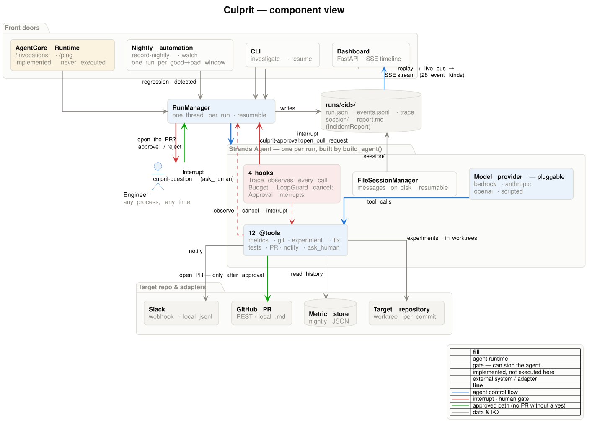
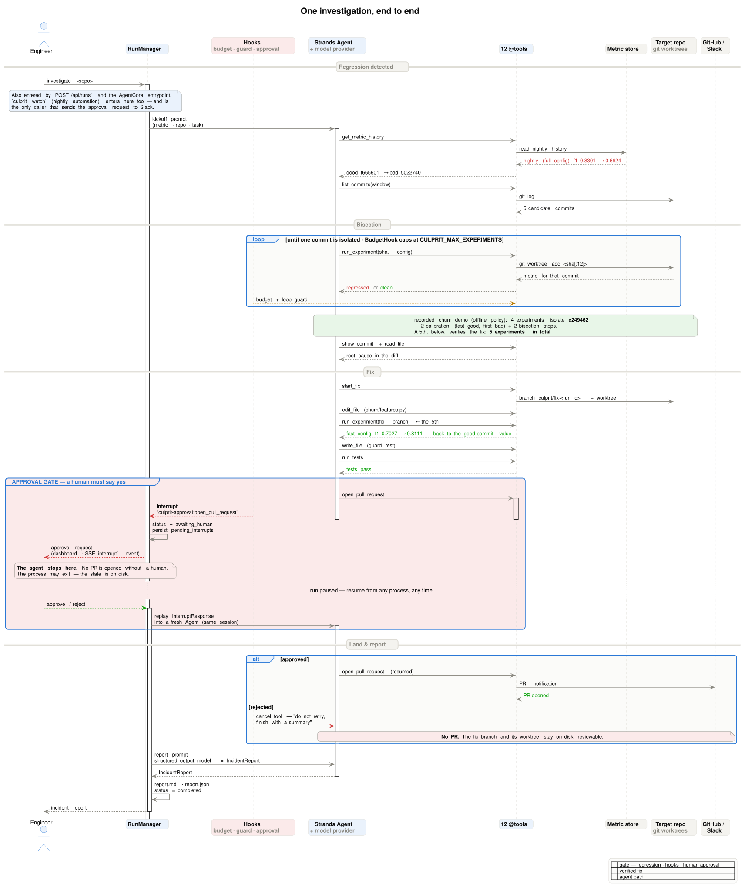
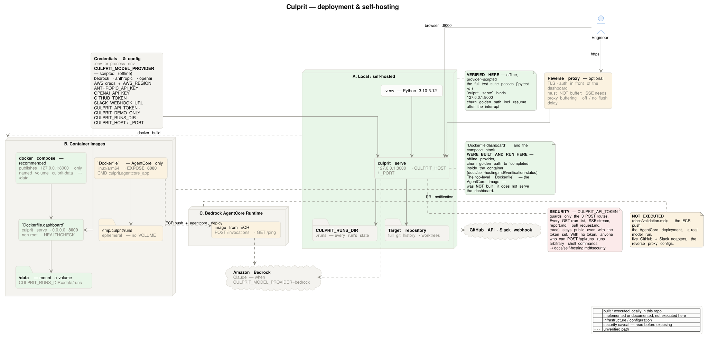

# Architecture diagrams

Three PlantUML sources, each rendered to `.svg` (for the web) and `.png` (for slides and GitHub
previews). Palette and skinparams live in [`_style.puml`](_style.puml) — an include only, never
rendered on its own.

**These three supersede `../architecture.png`, `../architecture.svg` and `../architecture.mmd`.**
That Mermaid diagram's hook box lists three hooks; the agent registers four
(`src/culprit/agents/investigator.py:77-84`). `../architecture-final.png` is marketing art (the
Devpost thumbnail), not a system diagram. Where they disagree, these three are current.

Amber means the same thing in all three: *implemented, but not executed in this repository.*

## [`architecture.puml`](architecture.puml) — component view



Answers **"what are the pieces, and who calls whom?"** — the four front doors (CLI, FastAPI
dashboard, the nightly `record-nightly` / `watch` automation, and the AgentCore runtime) all funnel
into one `RunManager`, which builds one Strands `Agent` per run. Prose walkthrough:
[`../architecture.md`](../architecture.md).

One caption worth spelling out: of the four hooks, `TraceHook` only observes (it never sets
`cancel_tool`); `BudgetHook` cancels `run_experiment` only, `ApprovalHook` interrupts the guarded
tools only (`open_pull_request` by default), and `LoopGuardHook` is the one that inspects every
tool call.

## [`investigation-sequence.puml`](investigation-sequence.puml) — one investigation, end to end



Answers **"what happens in what order, and exactly where does the human gate sit?"** — read the
metric history, bisect with real experiments, write the fix and its guard test, stop dead at
`open_pull_request` until a human answers (possibly from another process, days later), then land
and report.

Every number on it comes from the bundled churn demo run with the **offline scripted provider**
(`CULPRIT_MODEL_PROVIDER=scripted`), not from a real model run:

* Two different measurement configs appear, and the diagram labels both: the *nightly / full* config
  (`f1 0.8301 → 0.6624`) and the *smoke / fast* config used for experiments (`0.7027 → 0.8111` on
  the fix branch). The fix is not "worse than 0.8301" — it is a different scale.
* **4** experiments isolate the culprit (2 calibration + 2 bisection); a **5th** verifies the fix
  branch. Five in total, matching `"experiments": 5` in
  [`../evidence/offline-evaluation-churn.json`](../evidence/offline-evaluation-churn.json).
* The commit SHAs are **date-derived**: `demo_today()` (`src/culprit/demo/builder.py:46-52`) uses
  today's UTC date unless `CULPRIT_DEMO_TODAY` is set, so a demo generated on another day has
  different ids. To reproduce `f665601 → 5022740`, culprit `c249462`, run
  `CULPRIT_DEMO_TODAY=2026-09-13 culprit demo init --force`.

## [`deployment.puml`](deployment.puml) — deployment & self-hosting



Answers **"what can I run this on, and which parts have actually been run?"** — **A** local install,
**B** the container path (`docker compose` in front of `Dockerfile.dashboard`; the top-level
`Dockerfile` is the AgentCore image and serves no dashboard), **C** Bedrock AgentCore Runtime.
Prose: [`../self-hosting.md`](../self-hosting.md) and [`../deploy-agentcore.md`](../deploy-agentcore.md).

Green is what was built and executed here — including `Dockerfile.dashboard` and the compose stack,
which ran the churn golden path to `completed` inside the container
([verification status](../self-hosting.md#verification-status)). Amber is the AgentCore image, the
ECR push, the deployment, a real model provider, the live GitHub/Slack adapters and the reverse-proxy
configs — none of those were executed. The test *count* is deliberately not baked into the image;
it lives in [`../release-review.md`](../release-review.md), which can be edited without a re-render.

## Re-rendering

Needs Java and Graphviz `dot` on `PATH` plus the PlantUML jar — there is no jar in this repository.
Verified here with `java -version` → OpenJDK 21.0.9 and `dot -V` → Graphviz 2.43.0. Install
(**not executed here**): `sudo apt install -y default-jre graphviz` on Debian/Ubuntu, or
`brew install openjdk graphviz` on macOS; most distros also package `plantuml` itself.

```bash
curl -fsSLo /tmp/plantuml.jar https://github.com/plantuml/plantuml/releases/latest/download/plantuml.jar

# from the repository root
java -jar /tmp/plantuml.jar -tsvg docs/diagrams/architecture.puml docs/diagrams/investigation-sequence.puml docs/diagrams/deployment.puml
java -jar /tmp/plantuml.jar -tpng docs/diagrams/architecture.puml docs/diagrams/investigation-sequence.puml docs/diagrams/deployment.puml
```

The three paths are listed explicitly on purpose: `{a,b,c}` brace expansion is bash/zsh-only, and
`docs/diagrams/*.puml` would also render `_style.puml` into an empty image.

The committed `.svg` / `.png` were produced by exactly those two commands, with PlantUML
**1.2026.8** and Graphviz 2.43.0. They also render cleanly on 1.2025.4, with slightly different
spacing.
